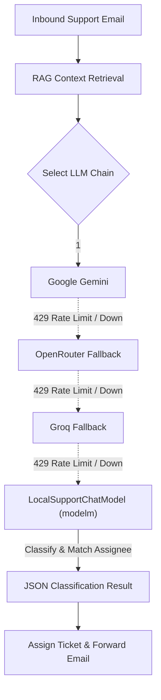

# ModelM: Local Support Ticket LLM & Classifier

`modelm` is a lightweight, self-contained neural ticket classifier and LangChain chat model built specifically for the support ticket routing system. It guarantees zero unassigned tickets even during complete cloud LLM outages or HTTP 429 rate-limit storms.

---

## 🚀 Key Highlights

- **Ultra-Low Resource Footprint**:
  - **RAM Usage**: ~15 MB (comfortably runs on 4 GB RAM machines like AMD Ryzen 3 / Intel i3).
  - **Inference Latency**: `< 5 ms` on modern multi-core CPUs.
  - **Dependencies**: Pure `numpy` + standard library + `langchain-core` (no PyTorch, TensorFlow, or ONNX runtime required).
  - **Zero Model Downloads**: No multi-gigabyte Hugging Face checkpoints to pull; weights are stored in a compact JSON file (`~790 KB`).
- **Native LangChain Integration**:
  - Subclasses `langchain_core.language_models.chat_models.BaseChatModel`.
  - Seamlessly interoperates with `invoke()`, `batch()`, and provider fallback chains.
  - Returns standard `AIMessage` containing structured JSON with `category`, `confidence`, `reasoning`, and matched `assignee_id`.
- **Tri-Source Training Pipeline**:
  - Learns from domain training tickets ([dataset.py](file:///d:/support/modelm/dataset.py)).
  - Ingests company routing policies from markdown docs in [api/src/knowledge_base/](file:///d:/support/api/src/knowledge_base/).
  - Ingests live staff member expertise and department records from [seed_data.py](file:///d:/support/api/src/scripts/seed_data.py).

---

## 📁 Directory Structure

```
modelm/
├── __init__.py           # Package marker
├── dataset.py            # Domain-specific ticket examples across 5 departments
├── model.py              # Pure NumPy TF-IDF vectorizer + Softmax classifier
├── train.py              # Ingestion, training, and weight serialization pipeline
├── langchain_model.py    # LocalSupportChatModel (LangChain BaseChatModel adapter)
├── weights.json          # Trained vocab, IDF vectors, weights, and biases (~790 KB)
├── metrics.json          # Last validation metrics (accuracy / per-class F1 / confusion)
├── pyproject.toml        # Ruff configuration (shared with api/)
├── README.md             # This documentation
└── tests/
    ├── __init__.py
    └── test_local_model.py  # Unit tests for training, inference, and LangChain integration
```

---

## 🧠 Architecture & Methodology

### 1. Tokenization & Feature Engineering (`model.py`)
- **Word & N-Gram Extraction**: Lowercases and normalizes text, extracting word tokens and word bigrams (e.g., `vpn connection`, `invoice approval`, `badge access`).
- **Subword Character N-Grams**: Generates 3-gram and 4-gram subwords (`#pass`, `#word`) for words $\ge 4$ characters to handle typos, plurals, and variations.
- **Sublinear TF-IDF**: Scales term frequencies with $\text{TF} = 1 + \ln(\text{count})$ and applies IDF with Laplace smoothing:
  $$\text{IDF}(t) = \ln\left(\frac{1 + N}{1 + \text{df}(t)}\right) + 1$$
- **L2 Vector Normalization**: Normalizes document vectors to unit length to prevent document length bias.

### 2. Multi-Class Softmax Classifier (`model.py`)
- **Linear Layer**: Computes raw class logits $z = XW + b$, where $W \in \mathbb{R}^{V \times K}$ and $b \in \mathbb{R}^K$.
- **Softmax Activation**: Evaluates normalized class probabilities:
  $$P(y = k \mid x) = \frac{e^{z_k}}{\sum_{j=1}^K e^{z_j}}$$
- **Optimization**: Trained using mini-batch gradient descent with cross-entropy loss and L2 weight decay ($10^{-4}$) to prevent overfitting.

### 3. LangChain Adapter (`langchain_model.py`)
- Extends `BaseChatModel` from `langchain_core`.
- Parses incoming message histories (e.g., System prompt containing candidate staff and Knowledge Base context, plus Human prompt containing email subject and body).
- Runs local inference, extracts top predicted category, maps candidate staff from the RAG prompt to find the appropriate `assignee_id`, and formats the output into strict JSON.

---

## 🔄 RAG Fallback Chain Integration

In [api/src/services/rag.py](file:///d:/support/api/src/services/rag.py), the local model is integrated into the ordered multi-provider chain:



> [!TIP]
> **Prefer Local Model First**:
> Set `USE_LOCAL_MODEL_FIRST=true` in your environment or configuration to evaluate tickets locally first and bypass cloud rate limits entirely.

---

## 🛠️ Usage Examples

### 1. Invoking via LangChain

```python
from langchain_core.messages import HumanMessage, SystemMessage
from modelm.langchain_model import LocalSupportChatModel

llm = LocalSupportChatModel()

messages = [
    SystemMessage(
        content="Available staff:\n- ID 1: Sarah Jenkins (IT Support)\n- ID 2: Michael Chang (Finance)"
    ),
    HumanMessage(
        content="Subject: VPN disconnected\n\nI cannot connect to the corporate VPN from home."
    ),
]

response = llm.invoke(messages)
print(response.content)
# Output:
# {
#   "category": "it_support",
#   "confidence": 0.96,
#   "reasoning": "Local model classified ticket into 'it_support' (confidence: 96%). Matched department staff: Sarah Jenkins.",
#   "assignee_id": 1
# }
```

### 2. Standalone Model Inference

```python
from modelm.model import CustomTicketClassifier

classifier = CustomTicketClassifier.load("modelm/weights.json")
category, confidence, scores = classifier.predict(
    "My salary direct deposit was not credited this month."
)

print(f"Predicted Category: {category} ({confidence * 100:.1f}%)")
# Predicted Category: finance_procurement (94.2%)
```

---

## 📦 Training & Testing

### Re-training the Model
If new sample tickets, staff expertise, or markdown knowledge base documents are added:

```powershell
python -m modelm.train
```

The training pipeline will:
1. Load samples from `modelm/dataset.py`.
2. Extract rules from `api/src/knowledge_base/*.md`.
3. Read staff expertise from `api/src/scripts/seed_data.py`.
4. Fit the classifier and save updated weights to `modelm/weights.json`.

### Running Unit Tests

```powershell
python -m pytest modelm/tests -v
```

---

## ➕ Adding New Departments

When introducing a new department to the support ticket system:
1. Add the staff member and department to `SUPPORT_STAFF` in [api/src/scripts/seed_data.py](file:///d:/support/api/src/scripts/seed_data.py).
2. Add the department policy markdown in [api/src/knowledge_base/](file:///d:/support/api/src/knowledge_base/) (using `**Contact:** {{contact_email}}`).
3. (Optional) Add representative training tickets to [modelm/dataset.py](file:///d:/support/modelm/dataset.py).
4. Run `python -m modelm.train` to update `weights.json`.
